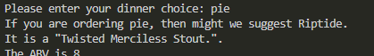

# Beer Recommender

This is a simple app for me to get used to APIs in Python. I have a project idea to use an API, and it was asked that I use Python for this project.

I haven't really made much with Python, and I have never worked with APIs in Python. I thougth a simple little app for fun would be a good way to get my feet wet.

## The Method

I followed along to [John Watson Rooney](https://www.youtube.com/@JohnWatsonRooney)'s video: "[HOW TO: JSON and APIs in PYTHON - A Beginners Look](https://www.youtube.com/watch?v=YgO5ff9sp7A)" to get an idea of how APIs in Python works.

- Uses the [`requests`](https://pypi.org/project/requests/) HTTP library that sends an HTTP/1.1 request to the API.
- The API used was the [Punk API](https://punkapi.com/documentation/v2).
  - The Punk API has built in querying.
  - I prompt the user for what type of food they are eating, and the API uses a fuzzy search to generate an array of objects.
    - This array of objects is a list of beers where the food pairings given for each beer in the API is fuzzy matched to the user's input.
- Once the API finds and builds an array of beers that match the food pairing, it chooses a random one to recommend using the [`Random`](https://www.geeksforgeeks.org/python-random-module/#) module, and generates a random recommendation to the screen.

## Screenshots

### Version 1

- This was basically the output from the video. I set up my own output however. I didn't follow the video's output example, I styled it myself.
